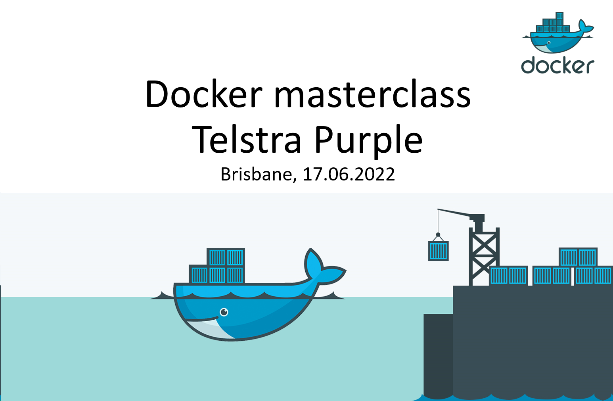

# Docker Masterclass

This repository contains the Docker masterclass presentation and practical examples. Each example has a dedicated branch with instructions inside the `README.md` and source code in the `Source` directory. Solution to the exercise can be found in `solution.ps1`.

## Prerequisites

-   [Visual Studio 2022](https://visualstudio.microsoft.com/vs/)
-   [Visual Studio Code](https://code.visualstudio.com/)
-   [GIT](https://git-scm.com/)
-   [Docker Desktop](https://www.docker.com/products/docker-desktop/)

## Example 1: Working with Docker images

Branch: Example-1-Working-with-Docker-images

## Example 2: Working with Docker containers

Branch: Example-2-Working-with-Docker-containers

## Example 3: Creating Docker images

Branch: Example-3-Creating-Docker-images

## Example 4: Working with Docker-compose

Branch: Example-4-Working-with-Docker-Compose

## Example 5: Working with Docker Engine API

Branch: Example-5-Working-with-Docker-Engine-API
